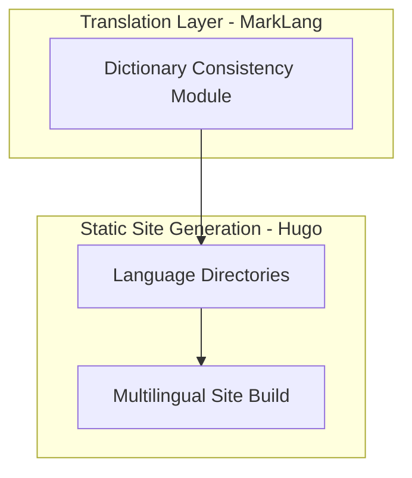
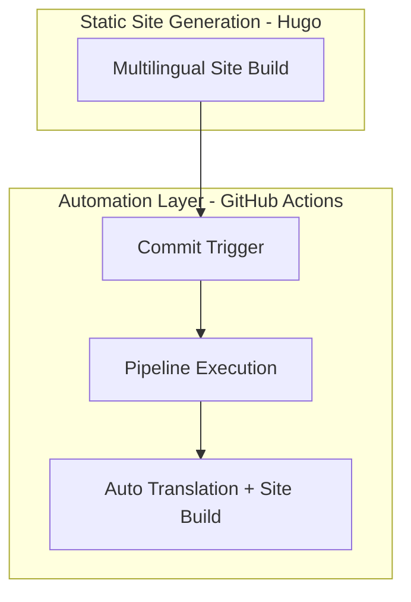
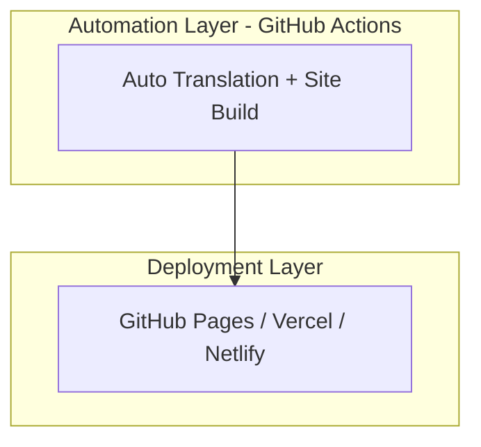

# Multilayer Translation + Deployment Architecture

## Diagram 1 – Content Authoring → Translation
```mermaid
graph TD
    subgraph L1[Content Authoring Layer]
        A1[English Markdown Files] --> A2[Front Matter Metadata]
    end

    subgraph L2[Translation Layer - MarkLang]
        B1[Parser] --> B2[LLM Translation (Ollama + LLaMA 3.2 3B)]
        B2 --> B3[Dictionary Consistency Module]
    end

    A2 --> B1
```

---

## Diagram 2 – Translation → Static Site Generation


---

## Diagram 3 – CI/CD Automation


---

## Diagram 4 – Deployment

